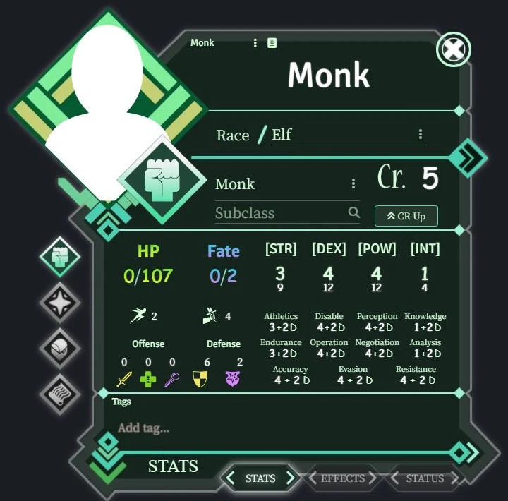
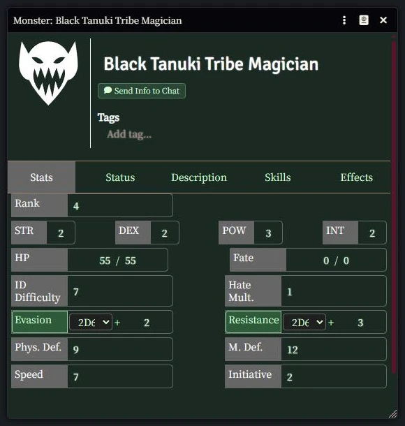
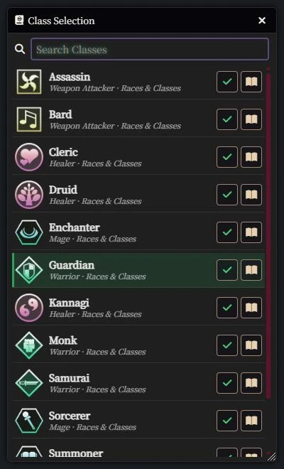
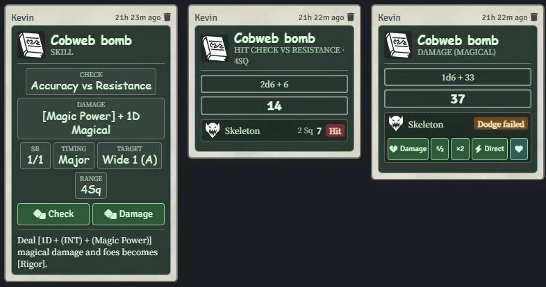

# Log Horizon TRPG para Foundry VTT

ログ・ホライズンTRPG

[](https://foundryvtt.com/)
[](https://github.com/DeadlyPoisonK/LHTTRPG/releases)
[](LICENSE.txt)

Read in English: [README.md](README.md) · Cambios: [CHANGELOG.md](CHANGELOG.md)

Sistema no oficial para jugar [Log Horizon TRPG](https://en.wikipedia.org/wiki/Log_Horizon) en Foundry Virtual Tabletop. Es un proyecto independiente de la comunidad, sin afiliación ni respaldo de Mamare Touno o Kadokawa.



## Características

- **Hojas de personaje y de monstruo**: hechas sobre ApplicationV2 de Foundry, con cálculo automático de stats, modificadores y checks.
- **Selector de opciones y skills iniciales**: se elige Raza, Clase y Subclase desde un selector; luego la hoja ofrece sus skills iniciales.
- **11 compendios incluidos**: Races & Classes, Basic Skills, Common & Subclass Skills, Racial Skills, Archetype Skills, Class Skills, Mount Skills, GM EX Powers, Items, Bestiary y Rules.
- **Checks enfrentados y tarjetas de combate**: tarjetas de chat para Hit contra esquiva (Evasion / Resistance) con reducción automática de daño (defensa física/mágica, Cancel, Barrier, HP), daño de Hate, Pursuit, Weakness y botón para deshacer.
- **Items usables y consumibles**: items con acción "Use", comprobación del timing según la fase, aplicación de Active Effects y consumo automático de los `[Consumable]`.
- **Editor de destinos de Active Effects**: el editor sugiere destinos válidos para personajes y monstruos, para que los efectos no apunten a campos que no existen.
- **Efectos de skills y límites de sostenidas**: las skills pueden aplicar sus efectos al usarse, respetando los límites de las sostenidas (Harmony: 1, Servant Summon: 1, Enchantment: 2), con un diálogo para elegir cuál reemplazar.
- **Estados de Log Horizon sincronizados con el token**: los 23 estados de Log Horizon (Life, Bad, Combat, Other) como estados de token, con Rating y tags, sincronizados en ambos sentidos con la hoja; `[Hidden]` oculta el token a los demás jugadores.
- **Duraciones de Log Horizon**: los efectos pueden caducar al final del proceso, de la ronda o de la escena.
- **Fases de combate**: el combat tracker sigue la progresión de ronda de Log Horizon (Briefing, Setup, Main/Initiative con declaración de Standby y seguimiento de Post-Action, y Cleanup).
- **Botín y comercio integrados (piles)**: actores tipo pile para botín en el suelo, cofres, mercaderes e intercambio directo de items y oro entre jugadores, sin módulos externos.
- **Recursos básicos**: Fate, Hate e inventario por espacios, ampliado con bolsas.







## Instalación

### Desde el buscador de paquetes de Foundry VTT

1. En Foundry VTT, abre la pestaña **Game Systems** de la pantalla de configuración.
2. Pulsa **Install System**.
3. Busca **Log Horizon TRPG** y pulsa **Install**.

### Con la URL del manifiesto

1. En Foundry VTT, abre la pestaña **Game Systems** de la pantalla de configuración.
2. Pulsa **Install System**.
3. Pega esta URL en el campo **Manifest URL**, abajo:

```
https://github.com/DeadlyPoisonK/LHTTRPG/releases/latest/download/system.json
```

4. Pulsa **Install**.

## Compatibilidad

- **Foundry VTT v13**: verificado y soportado (verificado hasta 13.351).
- **Foundry VTT v14**: sin verificar. El sistema carga en v14, pero los Active Effects y algunas funciones pueden fallar. El soporte de v14 llega en la versión **2.1**.
- **Importante**: un mundo abierto o migrado en Foundry v14 **no se puede volver a abrir en v13**. Haz siempre una copia de seguridad completa del mundo antes de probar versiones nuevas de Foundry.

## Contenido y fuentes

- **Compendios**: cerca del 98 % del texto de los compendios (incluido todo el bestiario) lo tradujo a mano DeadlyPoisonK del japonés al inglés hace unos tres años, antes de usar cualquier IA. En 2026 se revisó el texto y se completaron algunos huecos con ayuda de un modelo de IA local, corregidos a mano.
- **Base de datos de origen**: los datos de los compendios se adaptan de la base de datos oficial, pública y gratuita de Log Horizon TRPG: [lhrpg.com/lhz](https://lhrpg.com/lhz/top).
- **Journal de reglas**: el journal del compendio Rules y la hoja de referencia (`assets/rules/lhtrpg_cheat_sheet.pdf`) vienen de la traducción oficial gratuita de las reglas.
- **Aviso**: Log Horizon TRPG es propiedad de Mamare Touno y Kadokawa (ログ・ホライズンTRPG). Este sistema no es oficial ni está afiliado a ellos. Recomendamos tener los manuales oficiales.
- Las correcciones de la comunidad a los textos de los compendios son bienvenidas.

## Idiomas

La interfaz está traducida en `lang/`:

| Idioma | Código | Estado |
| :--- | :---: | :--- |
| English | `en` | Traducido por personas |
| Español | `es` | Traducido por personas |
| Français | `fr` | Base de la comunidad; claves nuevas traducidas con IA local (sin revisar por hablantes nativos) |
| Italiano | `it` | Base de la comunidad; claves nuevas traducidas con IA local (sin revisar por hablantes nativos) |
| 日本語 | `ja` | Base de la comunidad; claves nuevas traducidas con IA local (sin revisar por hablantes nativos) |
| 한국어 | `ko` | Base de la comunidad; claves nuevas traducidas con IA local (sin revisar por hablantes nativos) |

Los compendios solo están en inglés. Las traducciones y correcciones de hablantes nativos son muy bienvenidas por pull request.

## Contribuir

- **Issues**: reporta errores o sugiere mejoras en [GitHub Issues](https://github.com/DeadlyPoisonK/LHTTRPG/issues).
- **Traducciones**: edita `lang/*.json`. `npm run check:i18n` comprueba que no falten claves.
- **Editar los compendios**:
  - Las fuentes de los compendios están en `src/packs/<pack>/*.json`. No subas las bases de datos de `packs/`.
  - Instala las dependencias: `npm install`
  - Compilar los compendios (`src/packs` → `packs`): `npm run packs:build` (con el mundo cerrado: Foundry bloquea los packs de un mundo abierto).
  - Desempaquetar (`packs` → `src/packs`): `npm run packs:unpack` después de editar los compendios dentro de Foundry.
  - Los pull requests de compendios deben tocar `src/packs/`.

## Licencia

El código de este sistema (scripts, plantillas, estilos y archivos de idioma) está bajo licencia **MIT**; ver [LICENSE.txt](LICENSE.txt).

La licencia cubre solo el código del sistema; no cubre las reglas, el mundo ni la propiedad intelectual de Log Horizon TRPG, que pertenecen a Mamare Touno y Kadokawa.

## Créditos

- **Mamare Touno / Kadokawa**: creadores de Log Horizon y de Log Horizon TRPG (ログ・ホライズンTRPG).
- **Kyane (Tenyryas)**: creador original del sistema ([repositorio original](https://github.com/Tenyryas/lhtrpg)).
- **Asacolips Projects / Foundry Mods**: autores de la plantilla Boilerplate de la que partió el proyecto.
- **DeadlyPoisonK**: mantenimiento desde 2026 y traducción manual al inglés de los compendios.
- **Comunidad del proyecto original**: traducciones iniciales al francés, italiano, japonés y coreano.
- **Fuentes**: Noto Serif JP y Edu SA Beginner (`assets/fonts/`), bajo la SIL Open Font License 1.1 (`OFL.txt`).
- **Arte de la interfaz**: el resto de los recursos de la interfaz (`assets/ui/**`, `assets/Logo_lhtrpg.webp`) viene del sistema original de Kyane.
- **Íconos**: los íconos de estado (`assets/ui/status/*.svg`) son de [game-icons.net](https://game-icons.net), bajo [CC BY 3.0](https://creativecommons.org/licenses/by/3.0/) (fondo recoloreado). Autores: Lorc, Delapouite, Skoll, Sbed y Zeromancer. La lista completa está en el [README en inglés](README.md#credits).
